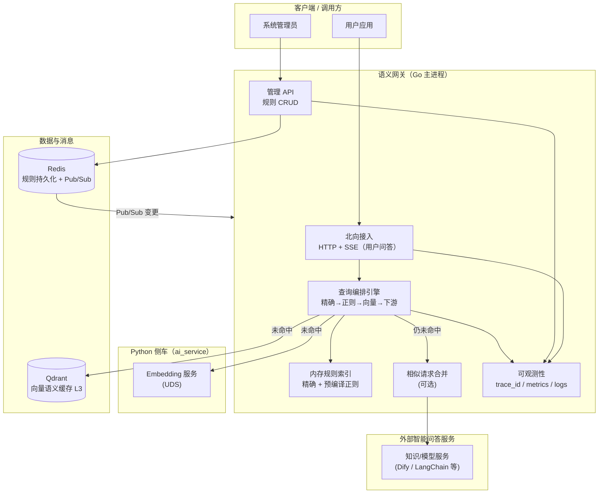

# 系统设计说明（@Architect）

> 依据：`specs/requirements.md`（产品需求 **v0.2**，含 FR-A01/A02 优先级与 **NFR-P02 统计口径** 的刷新）与仓库根目录 `.cursorrules`（工程约束）。
>
> 本文输出：**推荐目录树**、**系统架构图（含外部组件）**、**可测试的系统级需求**；**模块级开发需求**已拆分为 **`GO_DEV_REQUIREMENTS.md`** / **`PYTHON_DEV_REQUIREMENTS.md`**（见 §4）。
>
> 说明：本文供评审与排期使用；**Go↔Python UDS（Embedding）** 契约已落盘至 **`specs/architecture/contracts/`**，派发实现时见 **文末协作暗号**（`.cursorrules` 流水线）。

---

## 1. 推荐项目目录树（落地形态）

> 与 `.cursorrules` 对齐：`internal/` 为 Go 网关；`ai_service/` 为 Python 侧车；`test/` 为 QA；配置统一 `config.yaml`。

```text
.
├── .cursorrules
├── README.md
├── interface/                      # 北向 HTTP 契约（OpenAPI）；**本期唯一对外 API 规格**
│   ├── README.md
│   ├── openapi.yaml
│   └── PM_PRODUCT_REVIEW.md        # 与 @产品经理 对齐清单（字段/漏项）
├── docker-compose.yml
├── Dockerfile                      # Go 网关镜像（可选再拆多阶段）
├── config.yaml                     # Viper 统一配置（外部组件地址、超时、开关）
├── go.mod
├── go.sum
├── cmd/
│   └── gateway/
│       └── main.go                 # 进程入口：加载配置、启动网关、优雅退出
├── internal/                       # Go 业务实现（禁止被外部项目 import）
│   ├── bootstrap/                  # 组装依赖、启动 HTTP、信号处理（**本期不启动北向 gRPC**）
│   ├── config/                     # 配置结构与校验、环境变量绑定
│   ├── northbound/                 # 北向接入：实现 `interface/openapi.yaml`
│   │   ├── http/
│   │   └── grpc/                   # **本期不实现**；目录占位，避免后续与契约分叉时重构成本
│   ├── admin/                      # 管理员：精确/正则规则 CRUD（校验；**本期网关不内建鉴权**）
│   ├── rules/                      # 规则域：KEY/DAT、正则编译、优先级策略
│   ├── cache/                      # L1：内存精确/正则索引（BigCache 或等价）
│   ├── rulesync/                   # Redis 读写 + Pub/Sub 热更新 -> 内存原子替换
│   ├── embedding/                  # UDS 客户端：调用 Python 侧车（100ms 超时等）
│   ├── vector/                     # L3：向量库抽象 + Qdrant 实现
│   ├── downstream/                 # 智能问答下游适配（Dify/LangChain/OpenAI 等，可 Mock）
│   ├── coalesce/                   # 相似请求合并（单飞/分布式锁 + 等待，可配置）
│   ├── observability/              # trace_id、日志、Prometheus 埋点（工程约束）
│   └── integration/                # 可选：本地/CI 集成测试辅助（非必须）
├── ai_service/                     # Python 侧车（.cursorrules 指定目录）
│   ├── Dockerfile
│   ├── requirements.txt
│   ├── pyproject.toml              # 可选
│   ├── app/
│   │   ├── main.py                 # UDS 服务入口（FastAPI + uvicorn 或等价）
│   │   ├── schemas.py              # Pydantic 模型
│   │   └── embedder.py             # Embedding 推理封装
│   └── tests/
│       └── test_embed.py
├── scripts/
│   ├── test_integration.sh         # .cursorrules：Compose 全链路 E2E
│   └── perf/                       # 可选：k6 脚本、压测说明
├── test/                           # QA：端到端、契约、性能基线（与 internal 单测区分）
│   ├── e2e/
│   └── perf/
└── specs/
    ├── requirements.md              # PRD（当前仓库路径）
    └── architecture/
        ├── SYSTEM_DESIGN.md           # 本文件（总览）
        ├── GO_DEV_REQUIREMENTS.md     # Go 模块级开发需求（@Dev_Go）
        ├── PYTHON_DEV_REQUIREMENTS.md   # Python 模块级开发需求（@Dev_Python）
        └── contracts/                 # 跨语言内部契约（非北向 HTTP）
            ├── README.md
            ├── UDS_EMBEDDING.md       # Go↔Python UDS：Embedding 帧格式与 JSON 语义（v1.0 冻结）
            ├── UDS_INTERNAL_ALIGNMENT.md  # 双端对齐勾选 + 架构归档回执
            └── uds_embedding.schema.json
```

**与产品文档的关系**：`requirements.md` 不写内部实现；本目录树与下图用于把 **FR/NFR** 映射为可实现的边界与验收抓手。

### 1.1 北向契约（HTTP，本期）

- **唯一规格源**：根目录 `interface/openapi.yaml`（OpenAPI 3.0.3），覆盖用户问答、管理端规则 CRUD、健康检查。  
- **用户问答传输**：`POST /v1/qa` 成功时响应 **`Content-Type: text/event-stream`（SSE）**；增量文本在 `event: delta` 的 JSON 中拼接，元数据在 **`event: done`**（含 `source`、`traceId` 等）。请求体仍为 JSON；客户端须 `Accept: text/event-stream`。  
- **用户 SSE 鉴权（架构锁定，本期）**：**不采用 API Key、mTLS、Bearer**；与 `interface/openapi.yaml`（`info.version` ≥ 0.2.1）及 PRD §1.3 一致。生产环境依赖**网络隔离 / 前置网关**等部署手段；若产品未来要求用户端凭证，须**递增契约主版本或另立路径**并更新 PRD。  
- **规则配置与管理接口**：精确 KEY/DAT、正则表达式/DAT 的 **增删改查**（`/v1/admin/rules/...`）及 **`GET /v1/health`** 均为 **`application/json` 请求/响应**，**不采用 SSE**（与管理员操作、脚本调用习惯一致）。**本期架构裁剪**：**网关进程不对管理端做 API Key / JWT / Bearer 校验**；与 **用户 SSE 路径**一致，**访问控制由部署侧网络边界或前置网关**承担；若未来在网关内实现凭证，须 **PR + 递增 `interface/openapi.yaml` 主版本** 并同步 PRD。详见 `interface/openapi.yaml`。  
- **Go↔Python UDS（Embedding）**：**内部契约**见 **`specs/architecture/contracts/UDS_EMBEDDING.md`**（**v1.0 冻结**）、**`uds_embedding.schema.json`**（`$id` **v1.0_frozen**）、**`UDS_INTERNAL_ALIGNMENT.md`**（双端对齐与**架构归档回执**，2026-03-26）；wire **`protocolVersion` = 1**；与北向 `interface/openapi.yaml` 独立。  
- **gRPC**：**本期不作为北向交付物**；不生成北向 gRPC 服务端/客户端，不在验收范围内。根目录**不保留**空的 `api/`；若未来引入北向 gRPC 与 Proto 生成代码，再按需新增目录（如 `api/`、`gen/grpc/` 等），与 `interface/` 职责分离。  
- **产品对齐**：`interface/PM_PRODUCT_REVIEW.md` 供 @产品经理 确认字段、`source` 枚举、分页与删除语义等；**确认后再递增契约 `info.version` 并视为冻结**。  
- **实现约束**：`internal/northbound/http` 行为须与 OpenAPI 一致。  
- **最小可运行切片（已实现）**：`cmd/gateway` 使用 **Viper** 读取 `config.yaml` 中 `server.http_addr`；支持命令行 `-config`、`-http-addr-default`、`-shutdown-grace`；**SIGINT/SIGTERM 优雅停机**；已实现 **`GET /v1/health`**（JSON + `X-Trace-Id`），与 `interface/openapi.yaml` 对齐。  
- **SYS-FUNC-01（已验收 · 2026-03-27）**：精确规则 **Redis 持久化** + **内存热索引**（问答命中路径不读 Redis）；管理端 **`POST/GET /v1/admin/rules/exact`**（**本期无网关侧凭证校验**）；用户 **`POST /v1/qa` SSE** 精确命中返回 `delta`+`done(rule_exact)`；Redis **Pub/Sub** `rag:exact:changed` 触发多实例内存重载（单实例亦在写后本地 Reload）。验收见 `test/e2e/SYS_FUNC_01_DOCKER.md`；闸门见 **`SYS_ACCEPTANCE_PIPELINE.md` §3（次序 1 已通过）**。
- **FR-A02 / SYS-FUNC-02（已实现）**：正则规则 **Redis 持久化** + **内存预编译索引**（问答命中路径不读 Redis）；**`priority` 降序、同 priority 按 `updatedAt` 新者优先**；非法 pattern **拒绝入库**（**400**）；管理端 **`/v1/admin/rules/regex` 全量 CRUD**；用户 **`POST /v1/qa`** 在未命中精确（或未传 `key`）时对 **`query` 做正则匹配**，命中则 **`done.source`=`rule_regex`**；Redis **Pub/Sub** `rag:regex:changed` 热更新。设计追溯见 **`specs/architecture/FR_A02_DESIGN.md`**；Docker 验收见 **`test/e2e/SYS_FUNC_02_DOCKER.md`**。
- **SYS-FUNC-03 / FR-U03（已实现 · mock）**：未命中规则时，在可选 **Embedding** 成功后（向量库未接库时仍）调用 **`downstream` mock** 返回固定文本，SSE **`done.source`=`rag`**；配置见 **`config.yaml`** 的 **`downstream`**；验收见 **`test/e2e/SYS_FUNC_03_DOCKER.md`**；与 **SYS-FUNC-01～05** 一并纳入 **`scripts/test_integration.sh`**。
- **FR-U01 + 南向 LangChain（v0.1）**：用户提问路径须支持 **`sessionId` 透传**至智能问答下游；**南向锁定**为 **LangChain HTTP 服务**（独立进程），JSON 契约见 **`specs/architecture/contracts/HTTP_LANGCHAIN_DOWNSTREAM.md`**（默认 **`POST {base}/v1/rag/invoke`**）；网关 **`downstream.mode: langchain_http`** 对接；追溯见 **`specs/architecture/FR_U01_LANGCHAIN.md`**。
- **SYS-ENG-02（部分）**：暴露 **`GET /metrics`**（Prometheus）；计数器 **`gateway_qa_completed_total{source=...}`** 用于 QA 路径统计（与完整「指标字典」相比仍属最小集）。

---

## 2. 系统架构图（含外部组件）

### 2.1 逻辑架构（Mermaid）



### 2.2 关键数据流（与 `.cursorrules` 对齐）

1. **规则维护**：管理员 → **管理 API** → **Redis 持久化** → **Pub/Sub** → 各网关实例 **热更新内存索引**（无需重启）。
2. **用户问答（三级查询）**：
   - **北向应答形态**：用户路径成功时为 **SSE 流**（`delta` 拼接可见文本，`done` 收束并携带 `source` 等）；规则极速路径可将 DAT **单条 delta** 发出以满足流式客户端统一解析。
   - **精确**：仅走 **内存**（BigCache/哈希索引等实现细节由开发阶段确定，但必须满足 **NFR-P01**）。
   - **正则**：仅走 **内存**（预编译正则集合）；命中顺序遵循 **§1.1 与 PRD FR-A02**（`priority` 降序，同优先级取最新更新）。
   - **跨类型裁决**：若精确与正则均可命中，**精确优先**（PRD FR-A01）。
   - **向量**：Embedding 经 **UDS → Python 侧车**；向量检索 **Qdrant**。
   - **智能问答**：调用 **外部 RAG**；并支持 **相似请求合并**（减少风暴）。
3. **隔离性**：Python 侧车异常/OOM **不得拖死** Go 主进程（进程级隔离 + 超时熔断）。

### 2.3 NFR-P02 统计口径（与 PRD 对齐 + 工程实现建议）

> **产品已定义**（`requirements.md` §4）：统计范围为 **从北向接口被调用起，至把问题交给外部 RAG 服务之前**；**不包含**外部知识/模型服务自身处理时间。  
> **架构锁定（与产品意图一致）**：上述区间内 **必须计入**「未命中精确/正则之后、为判断是否可走缓存命中或进入智能问答而发生的 **向量语义检索路径**」——即 **Embedding（经 Python 侧车）+ 向量库检索（如 Qdrant）** 及其间网关编排开销。该段属于**网关整体对外耗时**的一部分；**仍不计入**外部 RAG 本体处理时间。

| 项目 | 产品口径（摘要） | 工程实现建议（用于可复现压测，不改变产品承诺） |
|---|---|---|
| **计时起点** | 北向接口被调用 | 建议在网关 **HTTP 处理器入口**打点（本期北向仅 HTTP；收到请求后、进入业务编排前同一 goroutine 栈内），避免将 TLS 握手算入（若未来启用 TLS，需单独声明）。 |
| **计时终点** | 交给外部 RAG **之前** | 建议在 **即将调用 `downstream` 适配器发送首包/发起连接之前**打点；**不得**包含外部 RAG 的排队与推理时间。 |
| **向量路径** | **必须计入 NFR-P02** | 从起点到终点之间，凡属「规则未命中后的 **Embedding + 向量库查询**（及熔断/降级分支前的等待）」均纳入 **NFR-P02**；压测用例需覆盖「未命中规则且走向量」的样本比例。 |
| **可观测性** | — | `observability` 模块输出 **同 trace 内两时间点差** 的直方图/摘要，并可拆分子阶段（规则 miss → embedding → vector → 合并等待 → 即将下游），供 QA 与 SYS-PERF-02 对齐验收。 |
| **SSE 与体感** | PRD 未单独定义「首字延迟」 | 建议额外打点 **首条 SSE 写出时间（TTFB）** 与 **首条 `delta` 时间**，用于流式体验分析；**不替代** NFR-P02 既有起止边界。 |

---

## 3. 可测试的系统级需求（给 QA / 验收）

> “系统级”指：**跨模块/跨进程/跨外部替身**仍可验收；其中包含完整 E2E，也包含**可独立执行的专项性能验收**（不要求同一条用例覆盖所有功能）。

> **自动化接力（闸门）**：本条各编号的 **开发 → @Reviewer → @QA** 须 **严格串行**：**仅当 @QA 对当前编号发出【测试通过】后**，方可进入**下一编号**的闭环。执行顺序、验收工件路径、实现状态与 QA 签核表见 **`specs/architecture/SYS_ACCEPTANCE_PIPELINE.md`**（由 @Architect 维护）。

### 3.1 端到端功能类（SYS-FUNC）

| 编号 | 来源 PRD | 系统级验收描述（可测试） | 主要依赖/替身 | 通过判据（示例） |
|---|---|---|---|---|
| SYS-FUNC-01 | FR-A01 + FR-U02 + FR-A03 | 管理员创建精确 KEY/DAT 后，用户在约定生效时间内提问命中并返回 DAT | Redis + 网关 + 用户 API | **SSE**：`delta` 拼接内容与 DAT 一致；`done.source`=`rule_exact`；重复 KEY 被拒绝（管理 API） |
| SYS-FUNC-02 | FR-A02 + FR-U02 + FR-A03 + FR-A01 | 管理员创建正则规则/DAT 后，用户提问命中并返回 DAT；非法正则在管理侧不可入库；多规则冲突时 **`priority` 降序，同 `priority` 取更新时间最新**；与精确 KEY 同场时 **精确优先** | Redis + 网关 + 用户 API | **SSE**：`delta` 拼接内容与 DAT 一致；`done.source`=`rule_regex`；非法规则保存失败；冲突场景用例集全部符合 PRD |
| SYS-FUNC-03 | FR-U01 + FR-U03 + NFR-G01 | 用户提问未命中规则时，可走智能问答并得到答案；外部服务故障时用户得到明确失败提示（非无限等待） | 下游 RAG **Mock/替身** | **SSE**：`delta` 拼接为答案；`done.source`=`rag`（或经向量缓存时按契约）；故障：`event:error` 或 HTTP 错误体，非无限等待 |
| SYS-FUNC-05 | NFR-G03 | 规则变更后，在生效窗口外重复同一问题，应答稳定一致（无不可解释抖动） | Redis + 多实例（可选） | 连续 N 次结果一致 |

> **说明（鉴权裁剪）**：原 **SYS-FUNC-04（NFR-G02 管理端鉴权）** 已从**本期系统设计验收表**移除：**网关不实现**管理端 401/403 凭证校验；**NFR-G02** 仍保留在 PRD，由**部署层**（网络隔离、前置网关、mTLS 等）落实。若产品要求**网关进程内**强制鉴权，须单独立项并回写 OpenAPI / 本表。

### 3.2 专项性能类（SYS-PERF）

> 与 `requirements.md` §4 **NFR-P01 / NFR-P02** 对齐；性能验收必须**先固化统计口径**（起点/终点、TLS、并发、Payload、实例数）。**NFR-P02** 计时区间见 **§2.3**（**含向量路径**）。

| 编号 | 来源 PRD | 系统级验收描述 | 测试方法要点 | 通过判据 |
|---|---|---|---|---|
| SYS-PERF-01 | NFR-P01 | **规则极速应答**：命中精确或正则并返回 DAT 的链路 P99 | k6/等价工具；固定规则集 + 固定问题集；不包含外部模型时间 | **P99 < 15ms**（按固化口径） |
| SYS-PERF-02 | NFR-P02 | **智能问答前置段（网关整体）**：未命中精确/正则后，统计 **北向调用起 → 交给外部 RAG 之前** 的 P99；区间 **包含** **Embedding（侧车）+ 向量库检索**；**不含**外部 RAG 自身处理时间 | 外部 RAG 使用**可控替身**；用例集中包含「走向量」样本；网关按 **§2.3** 起止点打点，可附加子阶段拆分；用户接口为 **SSE** 时，该指标仍以 **§2.3 边界** 为准，**不**要求用「首条 SSE」替代终点 | **P99 < 100ms**（与 PRD + §2.3 一致） |

### 3.3 工程约束类（SYS-ENG，来自 `.cursorrules`，用于验收“工程质量门槛”）

| 编号 | 描述 | 验收方式 |
|---|---|---|
| SYS-ENG-01 | 跨进程调用（Go→Python UDS、Go→Qdrant、Go→下游）具备 **100ms 级超时**与熔断/降级策略 | 故障注入 + 断言超时行为 |
| SYS-ENG-02 | 全链路请求可关联 `trace_id`；Prometheus 指标可抓取 | 抽样请求追踪 + `/metrics` 或等价 |
| SYS-ENG-03 | `docker compose up` 可一键启动；`scripts/test_integration.sh` 可跑通最小 E2E | CI/本地执行记录 |

---

## 4. 模块级开发需求

> 下述内容已拆分为两份子文件，便于 **@Dev_Go** / **@Dev_Python** 独立维护版本与评审；**不代表**接口已冻结——接口应在进入开发前通过「契约评审」固化（可在 `specs/architecture/contracts/` 或 `interface/` 落盘）。

| 子文件 | 读者 | 说明 |
|---|---|---|
| **`specs/architecture/GO_DEV_REQUIREMENTS.md`** | @Dev_Go | `cmd/` + `internal/` 模块表与 Go 单测要求 |
| **`specs/architecture/PYTHON_DEV_REQUIREMENTS.md`** | @Dev_Python | `ai_service/` 模块表与 pytest 要求 |
| **`specs/architecture/FR_A02_DESIGN.md`** | @Dev_Go / @QA | **FR-A02** 需求→实现→验收映射（正则规则 / DAT） |
| **`specs/architecture/FR_A01_EXACT_CRUD.md`** | @Dev_Go / @QA | **FR-A01** 精确规则 CRUD（含 **PATCH/DELETE**）与 Redis 索引 |
| **`specs/architecture/BACKLOG_NON_PERF.md`** | @Architect / 全员 | **非性能**类剩余 backlog（coalesce、向量、指标字典、鉴权边界等） |
| **`specs/architecture/FR_U01_LANGCHAIN.md`** | @Dev_Go / @Dev_Python / @QA | **FR-U01** + **南向 LangChain HTTP** 追溯与联调要点 |
| **`specs/architecture/SYS_ACCEPTANCE_PIPELINE.md`** | @Architect / @QA / 全员 | **§3 系统级需求** 串行闸门、验收工件、QA 签核与解锁规则 |
| **`specs/architecture/SYS_FUNC_01_DEV_CONFIRM.md`** | @Dev_Go / @Dev_Python | **SYS-FUNC-01** 双端自检范围、暗号与 FR-A01 边界说明 |
| **`specs/architecture/SYS_ENG_01_BREAKER.md`** | @Dev_Go / @Reviewer | **SYS-ENG-01** 熔断/降级与 `config.yaml` 键说明 |
| **`specs/architecture/SYS_OBSERVABILITY_METRICS.md`** | @Dev_Go / @QA | **SYS-PERF-02 / SYS-ENG-02** 锚点指标（Histogram 等） |
| **`specs/architecture/REVIEWER_CHECKLIST_SYS.md`** | @Reviewer | 系统级交付检视清单（按 SYS-* 勾选） |

**同步约定**：模块边界或验收口径变更时，架构师应**同时**更新对应子文件与本文件 §1 目录树/相关交叉引用（如 §2.3 NFR、§3 SYS-*）。

---

## 5. 风险与待决项（实现前评审）

1. **NFR-P02 与向量路径**：**已锁定**——「未命中规则后的 **Embedding + 向量库检索**」**计入** NFR-P02（见 **§2.3**），体现**网关整体**对外耗时；**外部 RAG 本体时间仍排除**。
2. **北向协议**：**本期已锁定仅 HTTP**；契约见根目录 **`interface/openapi.yaml`**（**用户问答 SSE**；**管理端与健康检查 JSON**）。**北向 gRPC 本期不实现、不验收**；`internal/northbound/grpc` 仅占位。若未来引入 gRPC，需新开版本评审并同步 PRD/契约，并**届时**再建 `api/`（或 `gen/`）等目录存放生成代码。
3. **TLS / API 网关**：若生产前置 SLB/API 网关，NFR 计时点是否以「到达网关进程」为准，建议在部署文档中声明（不改变 PRD 时，以本网关进程打点为准）。

---

## 6. 可测试性 / 可观测性视角的「启动开发」门禁（架构结论）

> 本节回答：**从可测、可观测出发，当前规格是否足以开工**；**本次不驱动开发介入**。

### 6.1 结论

**可以启动开发，但建议采用「两阶段」**：  
- **阶段 A（建议作为首个迭代，优先于大规模业务编码）**：**北向 HTTP** 以 **`interface/openapi.yaml`** 为事实源（产品已确认并归档时见 **§1.1** 与 `interface/PM_PRODUCT_REVIEW.md`）；**Go↔Python UDS（Embedding）** 已 **v1.0 冻结并架构归档**（**`contracts/UDS_EMBEDDING.md`** + **`UDS_INTERNAL_ALIGNMENT.md`**，2026-03-26）；**Prometheus 指标与标签字典**（含 NFR-P01/P02 起止点对应的 histogram/summary 名称与必选 label）；**trace_id 传递约定**（HTTP 头 `X-Trace-Id`，见 OpenAPI）。上述产物落地后，SYS-ENG-02、SYS-PERF-01/02 才具备**无歧义**的自动化验收锚点。  
- **阶段 B**：在契约与观测骨架就绪后，并行实现各 `internal/` 与 `ai_service/` 模块；向量与下游继续严格 **Mock**（与 `.cursorrules` 一致）。

若团队期望「不写一行业务代码前零待决」，则 **阶段 A 完成前**仅允许脚手架与契约仓库级 PR，**不宜**宣称 SYS-FUNC/SYS-PERF 已全部可验收。

### 6.2 已具备的可测 / 可观测基础（支持开工）

| 维度 | 说明 |
|---|---|
| **系统级验收锚点** | §3 已给出 SYS-FUNC-xx、SYS-PERF-xx、SYS-ENG-xx，且智能问答路径明确 **RAG 替身**、NFR-P02 **含向量路径**（§2.3），性能口径可复现。 |
| **分阶段观测意图** | §2.3 要求同 trace 内可拆 **规则 miss → embedding → vector → 合并等待 → 即将下游**，与 SYS-PERF-02 对齐。 |
| **工程质量门槛** | `.cursorrules` 与 SYS-ENG-01/02/03 要求 trace、Prometheus、`docker compose`、集成脚本，与可观测性目标一致。 |
| **单测与替身策略** | `GO_DEV_REQUIREMENTS.md` 要求向量与下游可 Mock；Python 侧见 `PYTHON_DEV_REQUIREMENTS.md`（Pydantic + pytest），便于契约测试。 |

### 6.3 仍待补齐项（不阻塞编码启动，但阻塞「一次过验收」）

| 项 | 对测试/观测的影响 | 建议处理 |
|---|---|---|
| **北向 HTTP 契约** | OpenAPI 已落盘 **`interface/openapi.yaml`**（含 SSE）；待产品走 `interface/PM_PRODUCT_REVIEW.md` 后冻结版本 | 产品确认后递增 `info.version`。 |
| **Go↔Python UDS（Embedding）** | **`UDS_EMBEDDING.md` v1.0 冻结** + **`uds_embedding.schema.json`** + **`UDS_INTERNAL_ALIGNMENT.md`** | **已架构归档**（2026-03-26）；修订走 PR，遵循 **`UDS_EMBEDDING.md` §9.2** |
| **指标命名与 label 未规范** | Prometheus 抓取后无法跨环境对比 P99、无法按阶段分解 | 输出「观测字典」：例如 `gateway_request_duration_seconds` 的 stage、`outcome`、`route` 等枚举。 |
| **FR-A03「约定时间」** | PRD 已写 **1 秒内**生效（`requirements.md`）；与 SYS-FUNC 一致 | 若变更窗口需同步改 PRD 与集成测试断言。 |
| **北向协议** | **本期已定 HTTP**（§5.2）；压测与 trace 以 `interface/openapi.yaml` 为准 | gRPC 不作为本期交付。 |
| **相似请求合并键定义** | coalesce 行为难以写确定性单测/集成测 | 在契约或 `internal/coalesce` 设计说明中写死「相似」的规范化规则（如规范化 query + scope）。 |

### 6.4 开发前提条件 READY 矩阵（与 @Dev_Go、@Dev_Python 对齐）

> 下表用于两位开发**同步认知**：哪些已 READY、哪些仍属**黄灯**（可开工但后续要返工/补文档）。**UDS Embedding** 以 `contracts/` 为事实来源后，由架构师按文末暗号派发双端实现。

**总判词**：**可以启动开发（建议仍按 §6.1 两阶段）**；**「前提条件完全 READY（零返工风险）」尚未成立**——**UDS 内部契约已 v1.0 冻结并归档**；北向 HTTP 见 **`interface/openapi.yaml`** 与 **`PM_PRODUCT_REVIEW.md`**；**观测指标字典未落盘**、**coalesce 相似键未写死**。

| 前提项 | 状态 | 说明 |
|---|---|---|
| PRD（`specs/requirements.md`） | **READY** | FR/NFR 与 FR-A03 窗口可测 |
| 系统设计（本文 + 目录树） | **READY** | 模块边界、NFR-P02 口径、SSE/JSON 分工已写清 |
| 北向契约（`interface/openapi.yaml` + `EXAMPLES.md`） | **黄灯** | **技术已可照着写**；**产品未走完** `PM_PRODUCT_REVIEW.md` 前，`info.version` 视为草案，字段/406/双形态等仍可能变 |
| Go↔Python **UDS**（Embedding） | **READY（v1.0 冻结，已归档）** | 事实来源：`contracts/UDS_EMBEDDING.md` + `uds_embedding.schema.json`；留痕 **`UDS_INTERNAL_ALIGNMENT.md`**；变更走 **§9.2** |
| Prometheus **指标名 + label 字典** | **未 READY** | 不阻塞写代码，阻塞 **SYS-ENG-02 / SYS-PERF** 的自动化对齐 |
| **coalesce**「相似」规范化规则 | **未 READY** | 不阻塞主链路骨架，阻塞合并逻辑的单测/确定性验收 |
| 下游 RAG **Mock 接口形状** | **黄灯** | `.cursorrules` 已要求可 Mock；建议在 `internal/downstream` 设计说明或接口文件中写死最小方法集 |

**@Dev_Go（`internal/`）**：配置/bootstrap、`config`、管理端对接 OpenAPI、**SSE** 按 **`interface/openapi.yaml`**、**`internal/embedding` 按已冻结 `contracts/UDS_EMBEDDING.md`（v1.0）**；联调 PR 补 **`UDS_INTERNAL_ALIGNMENT.md` §1** 勾选。  
**@Dev_Python（`ai_service/`）**：按 **v1.0 已冻结** 的 **`contracts/UDS_EMBEDDING.md`** 与 **`uds_embedding.schema.json`** 实现 UDS 与 **pytest**；联调 PR 补 **`UDS_INTERNAL_ALIGNMENT.md` §1**。

**建议两位开发一起对齐的会议结论（口头即可，不必发暗号）**：

1. **北向 HTTP** 以 **`interface/openapi.yaml`** 当前 `info.version` 为事实源。  
2. **UDS**：以 **`contracts/UDS_EMBEDDING.md` v1.0** 为事实源；差异以 **PR + §9.2** 修订。  
3. **观测**：由 Go 侧先出一页 **metrics 字典** PR，Python 侧补充 embedding 侧指标名（若有）。  

---

> 与 `specs/requirements.md` 同步更新；若 PRD 再次变更，请以 PRD 为准修订本章与 §2.3、§3.2。

> **修订（2026-03-27）**：**裁剪网关侧管理端鉴权**——§1 目录树移除 `internal/authn`；§1.1 / §3.1 同步；OpenAPI **`info.version: 0.2.3`**；**NFR-G02** 仍属 PRD，由**部署层**落实。  
> **修订（2026-03-27）**：**FR-A02 设计闭环**——新增 **`FR_A02_DESIGN.md`**；§1.1 增补 **SYS-FUNC-02** 已实现说明；E2E 见 **`test/e2e/SYS_FUNC_02_DOCKER.md`**。  
> **修订（2026-03-27）**：**§3 串行验收流水线**——新增 **`SYS_ACCEPTANCE_PIPELINE.md`**；§3 文首增加闸门说明；§4 索引该文件。

---

**【开发需求已更新，请 @Dev_Go 与 @Dev_Python 协同实现】**（范围：**按已冻结**的 **`specs/architecture/contracts/UDS_EMBEDDING.md`（v1.0）** 与 **`uds_embedding.schema.json`** 实现 UDS Embedding 帧编解码、`embed` 与 `ping/pong`、错误码语义；**100ms 级超时**与熔断策略见契约 §6 及 `.cursorrules`。联调 PR 须补 **`UDS_INTERNAL_ALIGNMENT.md` §1**。）

**【UDS 双端内部设计已对齐，请 @Architect 归档】**（双端确认无开放问题后发出；**本次已由架构师依团队指令完成 v1.0 文档归档**，双端仍须补签 **`UDS_INTERNAL_ALIGNMENT.md` §1**。）
